# sancheong-gift-map (산청사랑상품권 가맹점 지도)

[](./LICENSE)
[](https://ditto-404.github.io/sancheong-gift-map/)
[](https://leafletjs.com)
[](https://developers.kakao.com/docs/latest/ko/local/dev-guide)
[](scripts/build_data.py)
[](data/merchants.js)
[](#sancheong-gift-map-산청사랑상품권-가맹점-지도)
[](#english)

**산청사랑상품권**(모바일) 가맹점 1,730곳을 지도에 표시하고, 가맹점마다 **카카오맵 장소 페이지**로 바로 이동할 수 있게 만든 정적 웹페이지입니다.

**바로 열기: https://ditto-404.github.io/sancheong-gift-map/**

## 주요 기능

- **지도 + 목록 동시 탐색**: 가맹점이 많은 곳은 숫자 클러스터로 묶고, 확대하면 개별 핀이 나타납니다. 선택한 가게는 라임색 핀으로 강조됩니다.
- **검색과 필터**: 가게 이름, 주소, 업종으로 검색하고 11개 업종 버튼으로 범위를 좁힙니다. 버튼의 숫자는 현재 조건에 맞춰 바로 갱신됩니다.
- **프랜차이즈 영수증**: 지도 오른쪽 아래 **영수증 카드**에 하나로마트, CU, GS25, 다이소 등 10개 브랜드와 가맹점 수가 나옵니다. 브랜드 줄을 누르면 지도에 그 브랜드 매장만 남고 각 핀 옆에 매장 이름이 표시됩니다. 한 번 더 누르면 전체로 돌아갑니다.
- **카카오맵 연결**: 카카오에서 같은 가게를 찾은 1,027곳은 **카카오맵 장소 페이지**(영업시간, 리뷰, 사진)로, 나머지는 해당 좌표의 카카오맵 지도로 연결합니다. 길찾기 버튼도 함께 제공합니다.
- **내 위치 기준 정렬**: 위치 권한을 허용하면 목록을 가까운 순으로 정렬하고 거리를 표시합니다.
- **지도 화면 안만**: 스위치를 켜고 지도를 움직이면 현재 화면 안의 가맹점만 목록에 남깁니다.
- **모바일 대응**: 휴대폰에서는 소개, 검색, 지도, 업종, 목록 순서로 세로로 쌓이고 영수증 카드는 접힌 상태로 시작합니다.
- **링크 공유 미리보기**: 브라우저 탭과 카카오톡 등 공유 미리보기에 "산청사랑상품권 사용처 지도"라는 이름과 미리보기 이미지가 표시됩니다.

## 동작 원리

```mermaid
flowchart LR
    accTitle: 가맹점 지도 데이터 파이프라인
    accDescr: 군청 엑셀의 도로명주소를 카카오 로컬 API로 좌표와 장소 정보로 바꾸고, 빌드 스크립트가 합쳐 정적 페이지가 읽는 데이터 파일을 만듭니다.

    classDef input_style   fill:#e9eeec,stroke:#4c5b60,stroke-width:2px,color:#2c3a3d
    classDef process_style fill:#232522,stroke:#111111,stroke-width:2px,color:#f5f3ec
    classDef output_style  fill:#f6efde,stroke:#8a6f45,stroke-width:2px,color:#4a3b22
    classDef aux_style     fill:none,stroke:#a85e1a,stroke-width:2px,stroke-dasharray:4 3,color:#7a4712

    source_xlsx[군청 가맹점 엑셀]:::input_style
    build_queries[주소 정규화 queries.json]:::process_style
    address_search[카카오 주소 검색]:::process_style
    found_check{건물 번지 찾음?}:::process_style
    road_fallback[도로 단위 근사 위치]:::aux_style
    keyword_search[반경 2km 상호 검색]:::process_style
    geocode_json[좌표 캐시 geocode.json]:::output_style
    build_data[build_data.py 업종 분류]:::process_style
    merchants_js[merchants.js 데이터]:::output_style
    index_html[index.html 지도 페이지]:::output_style

    source_xlsx --> build_queries --> address_search --> found_check
    found_check -->|예| keyword_search
    found_check -.->|아니오| road_fallback -.-> keyword_search
    keyword_search -->|좌표, 장소 ID, 전화| geocode_json
    geocode_json --> build_data
    source_xlsx --> build_data
    build_data --> merchants_js --> index_html
```



- 좌표 변환은 **한 번만 실행해 `data/geocode.json`에 저장**합니다. 페이지는 API를 호출하지 않으므로 방문자 수와 관계없이 API 키나 호출량이 필요하지 않습니다.
- 상호 검색은 주소 좌표 반경 2km 안에서 이름 유사도가 0.6 이상이고, 600m를 넘으면 도로명주소까지 일치할 때만 같은 가게로 인정합니다.

## 사용법

웹페이지는 설치 없이 아래 주소에서 바로 사용합니다.

- https://ditto-404.github.io/sancheong-gift-map/

로컬에서 확인하려면 저장소를 내려받은 뒤 `index.html`을 브라우저로 열면 됩니다. 데이터는 `<script src="data/merchants.js">`로 읽으므로 로컬 웹서버 없이도 동작합니다.

## 사용 예시

- **"원지에서 점심 먹을 곳"**: 업종에서 `음식점`을 고른 뒤 지도를 원지 일대로 확대하고 `지도 화면 안만` 스위치를 켭니다.
- **"가까운 하나로마트"**: 영수증 카드에서 `하나로마트`를 누르면 산청군 하나로마트 지점이 이름과 함께 지도에 표시됩니다.
- **"곶감 살 수 있는 농가"**: 검색창에 `곶감`을 입력합니다. 시천면, 삼장면 농원이 목록과 지도에 함께 표시됩니다.
- **"지금 근처 주유소"**: 상단의 `내 주변 가맹점` 버튼을 누르고 업종에서 `자동차·주유`를 고르면 가까운 순으로 정렬됩니다.
- **"동의보감촌 근처 카페 영업시간"**: `동의보감` 검색 후 카페 항목의 `카카오맵` 버튼을 누르면 카카오맵 장소 페이지에서 영업시간과 리뷰를 확인할 수 있습니다.

## 데이터 갱신

새 가맹점 엑셀이 나오면 아래 순서로 갱신합니다.

**요구사항**

- Python 3.9 이상, `openpyxl`
- Node.js 18 이상 (내장 `fetch` 사용)
- 카카오 디벨로퍼스 앱의 **REST API 키** (https://developers.kakao.com 에서 앱을 만들면 발급됩니다)

**절차**

1. 새 엑셀 파일을 `data/source/` 폴더에 넣습니다. 파일 탐색기나 Finder로 복사해도 됩니다. 폴더 안에서 이름순으로 가장 마지막 파일을 사용하므로, 파일명은 `sancheong-gift-merchants-YYYY-MM.xlsx` 형식을 유지합니다.
2. 터미널(macOS/Linux) 또는 PowerShell(Windows)에서 저장소 폴더로 이동한 뒤 주소 목록을 만듭니다.
   ```bash
   pip install openpyxl
   python scripts/build_data.py --queries
   ```
3. 같은 터미널에서 카카오 키를 환경변수로 넘겨 좌표를 변환합니다. **기존 `geocode.json`에 없는 번호만 요청**하므로 매달 새로 추가된 가맹점만 API를 사용합니다.
   - macOS/Linux 터미널:
     ```bash
     KAKAO_REST_KEY=발급받은키 node scripts/geocode.mjs
     ```
   - Windows PowerShell:
     ```powershell
     $env:KAKAO_REST_KEY="발급받은키"; node scripts/geocode.mjs
     ```
4. 페이지용 데이터 파일을 다시 만듭니다.
   ```bash
   python scripts/build_data.py
   ```
5. 페이지 안의 기준 연월(`index.html`의 `2026년 6월`)과 `build_data.py`의 `asOf` 값을 새 기준월로 바꾼 뒤 커밋하고 push합니다. GitHub Pages가 자동으로 다시 배포합니다.

> 가맹점 번호(구분)가 바뀌는 새 엑셀이라면 기존 좌표와 번호가 어긋납니다. 이 경우 `data/geocode.json`을 지우고 3단계를 전체 다시 실행합니다.

## 프로젝트 구조

```text
sancheong-gift-map/
├── index.html                 # 지도 페이지 (HTML, CSS, JS 한 파일)
├── og-image.png               # 링크 공유 미리보기 이미지 (1200x630)
├── data/
│   ├── merchants.js           # 페이지가 읽는 최종 데이터 (빌드 산출물)
│   ├── geocode.json           # 가맹점 번호별 좌표, 카카오 장소 ID, 전화번호 캐시
│   ├── overrides.json         # 엑셀 주소가 실제 매장과 다른 가맹점의 위치 보정
│   └── source/
│       ├── sancheong-gift-merchants-2026-06.xlsx  # 원본 가맹점 목록
│       └── queries.json       # 지오코딩용 정규화 주소 (빌드 산출물)
├── scripts/
│   ├── build_data.py          # 엑셀 + 좌표 캐시 병합, 업종 분류
│   └── geocode.mjs            # 카카오 로컬 API 지오코딩
├── LICENSE
└── README.md
```

| 파일 | 역할 |
|---|---|
| `index.html` | Leaflet 지도, 클러스터, 검색과 필터, 영수증 카드, 목록, 모바일 레이아웃을 모두 담습니다. 지도 타일은 키가 필요 없는 OSM 표준 타일을 CSS로 흑백 처리해 페이지 톤에 맞춥니다(처음 쓴 CARTO 타일은 배포 후 API 키를 요구해서 교체했습니다). 빌드 도구 없이 GitHub Pages에 그대로 올라가도록 라이브러리는 CDN에서 불러옵니다. |
| `og-image.png` | 카카오톡, 슬랙 등에 링크를 공유할 때 뜨는 미리보기 이미지입니다. 페이지 `<head>`의 Open Graph 태그가 사이트 이름(산청사랑상품권 사용처)과 함께 이 이미지를 가리킵니다. |
| `data/merchants.js` | `window.MERCHANTS`에 가맹점 배열을 담습니다. JSON 대신 스크립트 파일로 둔 이유는 `index.html`을 로컬에서 더블클릭으로 열어도 `fetch` 제한 없이 동작하게 하기 위해서입니다. |
| `data/geocode.json` | `[번호, 위도, 경도, 장소ID, 카테고리 인덱스, 전화, 정밀도]` 행 배열입니다. 정밀도는 `0` 건물, `1` 장소 검색, `2` 도로 단위 근사입니다. API 결과를 캐시해 두기 때문에 갱신 시 새 가맹점만 다시 요청합니다. |
| `data/overrides.json` | 가맹점 번호별로 좌표, 장소 ID, 전화, 표시 주소를 덮어씁니다. 각 항목의 `name_check`가 엑셀 상호에 들어 있지 않으면 빌드가 멈추므로, 엑셀 번호가 바뀌어 엉뚱한 가맹점이 옮겨지는 일을 막습니다. |
| `scripts/build_data.py` | 엑셀을 읽어 산청군 주소와 역외 주소(온라인 가맹점 등)를 나누고, 카카오 카테고리 또는 상호 키워드로 11개 업종에 배정합니다. 카카오에서 장소를 찾지 못한 가맹점도 이름 키워드로 분류해 "기타"가 과도하게 커지지 않게 합니다. |
| `scripts/geocode.mjs` | 주소 검색, 실패 시 도로 단위 재검색, 반경 2km 상호 검색 순으로 좌표와 장소 정보를 얻습니다. 키는 환경변수로만 받아 저장소에 남지 않습니다. |

## 설계 원칙

- **좌표는 미리 계산합니다.** 방문할 때마다 주소를 변환하면 1,700여 건 호출로 첫 화면이 느려지고 API 키를 페이지에 노출해야 합니다. 한 번 변환한 결과를 저장소에 두면 페이지는 순수 정적 파일이 됩니다.
- **카카오 주소 검색을 쓴 이유**: 처음에는 키 없이 쓸 수 있는 OSM Nominatim을 시험했지만, 산청군 도로명주소는 번지 단위로 전혀 찾지 못하고 도로 단위까지만 반환했습니다. 카카오 주소 검색으로 바꾼 뒤 1,724건 중 1,715건을 건물 단위로 찾았고, 4건은 상호 검색으로 위치를 보완했습니다.
- **근사 위치는 숨기지 않습니다.** 건물 번지를 찾지 못한 4건은 도로 위치로 표시하고, 지도에서는 점선 테두리 핀과 팝업 안내 문구로 구분합니다. 끝내 위치를 찾지 못한 1건(삼장면 평촌유평로20번길)은 목록에만 남깁니다.
- **장소 매칭은 보수적으로 합니다.** 상호가 비슷해도 600m 넘게 떨어져 있으면 주소가 일치할 때만 같은 가게로 봅니다. 잘못된 장소 페이지로 연결하는 것보다 좌표 지도 링크로 연결하는 편이 낫기 때문입니다.
- **역외 주소 가맹점 6곳**(땡겨요, 제로페이, e경남몰 등 온라인·본사 주소)은 지도에 찍지 않고 목록 맨 아래 별도 항목으로 보여줍니다.
- **본점 주소로 등록된 지점은 따로 보정합니다.** 엑셀에는 하나로마트 9개 지점이 모두 산청군농협 본점 주소(산청읍 웅석봉로 3)로 올라 있어, 처음에는 한 점에 9개가 겹쳐 있었습니다. 카카오맵에서 실제 매장이 확인된 7개 지점은 `data/overrides.json`으로 위치를 옮겼고, 매장을 특정하지 못한 오성지소와 오전점은 엑셀 주소 그대로 둡니다.

## 데이터 출처와 주의

- 가맹점 목록: 산청군청 홈페이지 [「2026년 모바일 산청사랑상품권 가맹점 등록 현황」](https://www.sancheong.go.kr/www/selectBbsNttView.do?key=1466&bbsNo=126&nttNo=162687) (2026년 6월 기준, 원본 엑셀은 `data/source/`에 함께 보관)
- 좌표, 장소 ID, 전화번호: 카카오 로컬 API (2026년 10월 조회)
- 지도 타일: © OpenStreetMap contributors (OSM 표준 타일을 CSS로 흑백 처리)
- 가맹점 등록 현황은 수시로 바뀝니다. **결제 가능 여부는 매장에서 확인**하시기 바랍니다.

## 라이선스

코드는 [MIT](./LICENSE) 라이선스입니다. 가맹점 목록은 산청군 공개 자료이며, 카카오 장소 정보의 이용 조건은 카카오 서비스 약관을 따릅니다.

---

<a id="english"></a>

## English

[](#sancheong-gift-map-산청사랑상품권-가맹점-지도)
[](#english)

A static web page that puts all 1,730 merchants accepting the **Sancheong Sarang gift certificate** (mobile) on a map, with a one-tap link from each merchant to its **Kakao Map place page**.

**Open it: https://ditto-404.github.io/sancheong-gift-map/**

### Features

- **Map and list together**: dense areas collapse into numbered clusters; zooming in reveals individual pins, and the selected shop is highlighted with a lime pin.
- **Search and filters**: search by shop name, address or category, then narrow down with 11 business-type buttons. Button counts update to match the current filters.
- **Franchise receipt**: the **receipt card** at the bottom right of the map lists 10 brands such as Hanaro Mart, CU, GS25 and Daiso with their merchant counts. Tapping a brand line leaves only that brand on the map and shows each store name next to its pin. Tapping it again returns to everything.
- **Kakao Map links**: the 1,027 merchants that were matched to a Kakao place open the **Kakao Map place page** (hours, reviews, photos); the rest open Kakao Map at their coordinates. A directions button sits next to it.
- **Sort by distance**: after allowing location access, the list is sorted nearest first and shows the distance.
- **Only what is on screen**: turn on the switch and pan the map; the list keeps only the merchants inside the current view.
- **Phone layout**: on phones the intro, search, map, business types and list stack vertically, and the receipt card starts collapsed.
- **Link previews**: the browser tab and share previews (KakaoTalk and others) show the name "산청사랑상품권 사용처 지도" (Sancheong gift certificate merchant map) with a preview image.

### How it works

```mermaid
flowchart LR
    accTitle: Merchant map data pipeline
    accDescr: Road-name addresses from the county spreadsheet are turned into coordinates and place info with the Kakao Local API, then a build script merges them into the data file the static page reads.

    classDef input_style   fill:#e9eeec,stroke:#4c5b60,stroke-width:2px,color:#2c3a3d
    classDef process_style fill:#232522,stroke:#111111,stroke-width:2px,color:#f5f3ec
    classDef output_style  fill:#f6efde,stroke:#8a6f45,stroke-width:2px,color:#4a3b22
    classDef aux_style     fill:none,stroke:#a85e1a,stroke-width:2px,stroke-dasharray:4 3,color:#7a4712

    source_xlsx[County merchant spreadsheet]:::input_style
    build_queries[Normalized addresses queries.json]:::process_style
    address_search[Kakao address search]:::process_style
    found_check{Building number found?}:::process_style
    road_fallback[Approximate road-level position]:::aux_style
    keyword_search[Shop name search within 2km]:::process_style
    geocode_json[Coordinate cache geocode.json]:::output_style
    build_data[build_data.py type classification]:::process_style
    merchants_js[merchants.js data]:::output_style
    index_html[index.html map page]:::output_style

    source_xlsx --> build_queries --> address_search --> found_check
    found_check -->|yes| keyword_search
    found_check -.->|no| road_fallback -.-> keyword_search
    keyword_search -->|coords, place ID, phone| geocode_json
    geocode_json --> build_data
    source_xlsx --> build_data
    build_data --> merchants_js --> index_html
```



- Geocoding runs **once and is stored in `data/geocode.json`**. The page never calls the API, so it needs no API key and no quota no matter how many people visit.
- A Kakao place counts as the same shop only when the name similarity is at least 0.6 within 2 km of the address, and only when the road address also matches if it is more than 600 m away.

### Usage

The page needs no installation. Open:

- https://ditto-404.github.io/sancheong-gift-map/

To check it locally, download the repository and open `index.html` in a browser. Data is loaded with `<script src="data/merchants.js">`, so it works without a local web server.

### Usage examples

- **"Somewhere for lunch in Wonji"**: pick `음식점` (restaurants), zoom into Wonji and turn on the `지도 화면 안만` (only what is on screen) switch.
- **"Nearest Hanaro Mart"**: tap `하나로마트` on the receipt card; every Hanaro Mart branch in the county appears on the map with its name.
- **"Farms selling dried persimmons"**: type `곶감` in the search box. Farms in Sicheon-myeon and Samjang-myeon show up in the list and on the map.
- **"Nearest gas station right now"**: tap the `내 주변 가맹점` (merchants near me) button at the top and pick `자동차·주유` (cars and fuel); the list is sorted nearest first.
- **"Opening hours of a cafe near Donguibogam Village"**: search `동의보감`, then tap `카카오맵` on a cafe to see hours and reviews on its Kakao Map place page.

### Updating the data

When a new merchant spreadsheet is published, update it in this order.

**Requirements**

- Python 3.9 or later with `openpyxl`
- Node.js 18 or later (uses the built-in `fetch`)
- A **REST API key** from a Kakao Developers app (create an app at https://developers.kakao.com to get one)

**Steps**

1. Put the new spreadsheet in `data/source/`. Copying it with File Explorer or Finder works too. The script uses the last file by name, so keep the `sancheong-gift-merchants-YYYY-MM.xlsx` naming.
2. In a terminal (macOS/Linux) or PowerShell (Windows), go to the repository folder and write the address list.
   ```bash
   pip install openpyxl
   python scripts/build_data.py --queries
   ```
3. In the same terminal, pass the Kakao key as an environment variable and geocode. **Only numbers missing from the existing `geocode.json` are requested**, so each monthly update spends API calls only on new merchants.
   - macOS/Linux terminal:
     ```bash
     KAKAO_REST_KEY=your-key node scripts/geocode.mjs
     ```
   - Windows PowerShell:
     ```powershell
     $env:KAKAO_REST_KEY="your-key"; node scripts/geocode.mjs
     ```
4. Rebuild the page data file.
   ```bash
   python scripts/build_data.py
   ```
5. Change the reference month in the page (`2026년 6월` in `index.html`) and `asOf` in `build_data.py`, then commit and push. GitHub Pages redeploys automatically.

> If the new spreadsheet renumbers merchants (the 구분 column), existing coordinates no longer line up with the numbers. In that case delete `data/geocode.json` and rerun step 3 for everything.

### Project structure

```text
sancheong-gift-map/
├── index.html                 # Map page (HTML, CSS and JS in one file)
├── og-image.png               # Link preview image (1200x630)
├── data/
│   ├── merchants.js           # Final data read by the page (build output)
│   ├── geocode.json           # Coordinates, Kakao place IDs and phones per merchant number
│   ├── overrides.json         # Location fixes for merchants whose listed address is not the store
│   └── source/
│       ├── sancheong-gift-merchants-2026-06.xlsx  # Original merchant list
│       └── queries.json       # Normalized addresses for geocoding (build output)
├── scripts/
│   ├── build_data.py          # Merges spreadsheet and coordinate cache, classifies types
│   └── geocode.mjs            # Kakao Local API geocoding
├── LICENSE
└── README.md
```

| File | Role |
|---|---|
| `index.html` | Holds the Leaflet map, clusters, search and filters, receipt card, list and phone layout. Map tiles are keyless OSM standard tiles turned greyscale with CSS to match the page (the CARTO tiles used at first started asking for an API key after deployment, so they were replaced). Libraries load from CDNs so it can go to GitHub Pages as is, with no build tool. |
| `og-image.png` | Preview image shown when the link is shared in KakaoTalk, Slack and so on. Open Graph tags in the page `<head>` point to it along with the site name (산청사랑상품권 사용처). |
| `data/merchants.js` | Puts the merchant array on `window.MERCHANTS`. It is a script rather than JSON so that `index.html` also works when opened straight from disk, without `fetch` restrictions. |
| `data/geocode.json` | Rows of `[number, lat, lng, place ID, category index, phone, precision]`. Precision is `0` building, `1` place search, `2` approximate road level. Caching API results means updates only request new merchants. |
| `data/overrides.json` | Overrides coordinates, place ID, phone and displayed address per merchant number. The build stops if an entry's `name_check` is not part of the spreadsheet name, so a renumbered spreadsheet cannot move the wrong merchant. |
| `scripts/build_data.py` | Reads the spreadsheet, separates Sancheong addresses from outside ones (online merchants and so on), and assigns each merchant to one of 11 types from its Kakao category or name keywords. Merchants Kakao could not match are still classified by name so the "other" group does not balloon. |
| `scripts/geocode.mjs` | Gets coordinates and place info by address search, a road-level retry on failure, then a shop name search within 2 km. The key is read only from an environment variable and never lands in the repository. |

### Design principles

- **Coordinates are computed ahead of time.** Geocoding on every visit would mean about 1,700 calls before the first view and an API key exposed in the page. Storing the results in the repository keeps the page purely static.
- **Why Kakao address search**: the first attempt used OSM Nominatim, which needs no key, but it could not resolve Sancheong road-name addresses to building numbers at all and only returned whole roads. After switching to Kakao address search, 1,715 of 1,724 addresses resolved to the building, and shop name search filled in 4 more.
- **Approximate positions are not hidden.** The 4 merchants whose building number could not be found are shown at the road position, marked with a dashed pin border and a note in the popup. The one address that could not be found at all (Samjang-myeon, Pyeongchon-yupyeong-ro 20beon-gil) stays in the list only.
- **Place matching is conservative.** A similar name more than 600 m away counts only when the address also matches. Linking to the map at the right coordinates beats linking to the wrong place page.
- **The 6 merchants with addresses outside the county** (Ddangyo, Zero Pay, e-Gyeongnam Mall and other online or head office addresses) are not pinned; they are listed in a separate section at the end of the list.
- **Branches listed under the head office address are corrected separately.** The spreadsheet lists all 9 Hanaro Mart branches at the Sancheong-gun Nonghyup head office address (Sancheong-eup, Ungseokbong-ro 3), so at first all 9 sat on one point. The 7 branches whose stores could be confirmed on Kakao Map are moved with `data/overrides.json`; Oseong and Ojeon, whose stores could not be pinned down, keep the spreadsheet address.

### Data sources and caveats

- Merchant list: Sancheong County Office website, ["2026 mobile Sancheong Sarang gift certificate merchant registrations"](https://www.sancheong.go.kr/www/selectBbsNttView.do?key=1466&bbsNo=126&nttNo=162687) (as of June 2026; the original spreadsheet is kept in `data/source/`)
- Coordinates, place IDs and phone numbers: Kakao Local API (queried October 2026)
- Map tiles: © OpenStreetMap contributors (OSM standard tiles, turned greyscale with CSS)
- Merchant registrations change often. **Check with the shop that it still accepts the certificate.**

### License

The code is under the [MIT](./LICENSE) license. The merchant list is public data from Sancheong County, and Kakao place information is subject to Kakao's terms of service.
